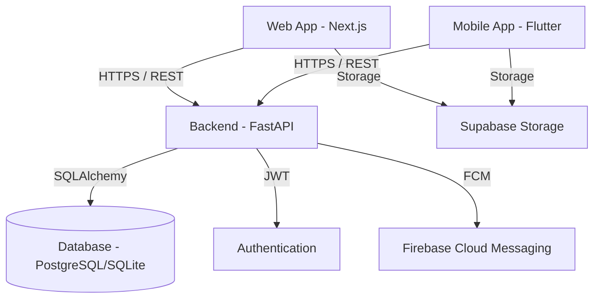
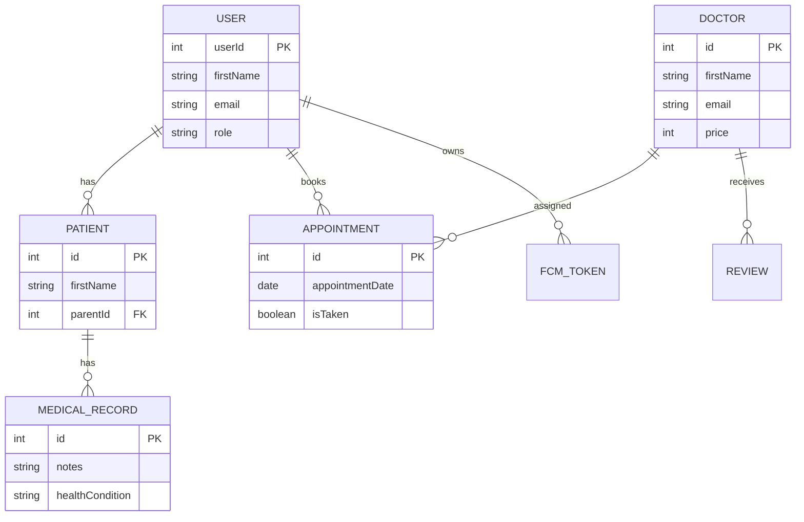

# 🐻 CareCubs Clinic — Pediatric Healthcare Management System

[](https://nextjs.org/)
[](https://fastapi.tiangolo.com/)
[](https://flutter.dev/)
[](https://www.python.org/)
[](https://www.typescriptlang.org/)
[](https://www.postgresql.org/)
[](https://tailwindcss.com/)

> A comprehensive, full-stack clinic management ecosystem designed to streamline operations for pediatricians, clinic staff, and parents.

## 📋 Table of Contents
- [Features](#-features)
- [Architecture](#-architecture)
- [Database Schema](#%EF%B8%8F-database-schema)
- [Tech Stack](#-tech-stack)
- [API Overview](#-api-overview)
- [Getting Started](#-getting-started)
- [Deployment](#-deployment)
- [Project Structure](#-project-structure)
- [Contact](#-contact)

---

## ✨ Features

### Web Application
- **Patient Portal:** Enables parents/guardians to book appointments, view their child's medical records, and communicate with healthcare providers.
- **Doctor Portal:** Provides doctors with tools to manage patient information, schedule appointments, and access full medical histories.
- **Staff Portal:** Allows clinic staff to handle administrative tasks and manage daily patient flow.
- **Admin Panel:** Offers administrative capabilities for managing user roles, monitoring system performance, and configuring clinic settings.

### Mobile Application (Flutter)
- **Cross-Platform Access:** Patient and Doctor portals on iOS and Android.
- **Push Notifications:** Automated appointment reminders powered by Firebase Cloud Messaging.

---

## 🏗️ Architecture



---

## 🗄️ Database Schema



---

## 🛠️ Tech Stack

| Layer | Technology | Purpose |
|-------|------------|---------|
| **Frontend** | Next.js 14, React 18, Tailwind CSS | Responsive, SEO-friendly, modern UI components |
| **Backend** | Python, FastAPI, SQLAlchemy | High-performance async REST API and ORM |
| **Mobile** | Flutter, Dart | Cross-platform native mobile experience |
| **Database** | PostgreSQL (Supabase) / SQLite | Relational data persistence (local fallback) |
| **Storage** | Supabase Storage | User and doctor profile avatars |
| **Push / Jobs** | Firebase Cloud Messaging, APScheduler | Automated background appointment reminders |
| **CI/CD** | GitHub Actions | Automated builds and deployments to Azure |

---

## 📡 API Overview

The backend exposes a comprehensive RESTful API protected by JWT authentication.

| Method | Endpoint | Description | Auth Required |
|--------|----------|-------------|---------------|
| `POST` | `/login` | Authenticate user and receive JWT | ❌ |
| `POST` | `/add/patient/{parentId}` | Register a new child for a parent | ✅ (Parent) |
| `GET` | `/doctorList` | Fetch public list of all doctors | ❌ |
| `GET` | `/get/appointments/{doctorId}`| Get doctor's schedule | ✅ (Doctor) |
| `POST` | `/add/medicalRecord/{doctorId}`| Add a new medical record | ✅ (Doctor) |
| `GET` | `/get/Number/of/doctors` | Admin analytics | ✅ (Admin) |

*(Full interactive API documentation is available at `/docs` when running the backend)*

---

## 🚀 Getting Started

### Prerequisites
- **Node.js** (v18+)
- **Python** (v3.10+)

### 1. Backend Setup
```bash
git clone https://github.com/YoussefYoussefG/CareCubs-Clinic.git
cd CareCubs-Clinic/backend
python -m venv venv
source venv/bin/activate  # Or venv\Scripts\activate on Windows
pip install -r requirements.txt
uvicorn main:app --reload --port 8000
```
> **Note:** The backend uses local SQLite (`carecubs_test.db`) by default. View docs at `http://localhost:8000/docs`.

### 2. Frontend Setup
```bash
cd frontend
npm install
echo 'NEXT_PUBLIC_SERVER_NAME="http://localhost:8000"' > .env.local
npm run dev
```
Navigate to `http://localhost:3000`.

### 3. Mobile App
- Download the Android APK: [Download CareCubs APK](https://drive.google.com/uc?export=download&id=1SytD4rQxmdjy4ixm1Odtz4UqUjFXSlVc)

---

## 🌐 Deployment

The system is configured for cloud deployment:
- **Frontend**: Designed for [Vercel](https://vercel.com/)
- **Backend**: Designed for [Render](https://render.com) or [Railway](https://railway.app)
- **Database**: Designed for [Supabase](https://supabase.com) PostgreSQL

For detailed, step-by-step instructions, see the [Deployment Guide](DEPLOYMENT_GUIDE.md) and [Supabase Setup Guide](SUPABASE_GUIDE.md).

---

## 📁 Project Structure

```text
CareCubs-Clinic/
├── backend/            # FastAPI REST API
│   ├── routes/         # Endpoint handlers (auth, users, doctors)
│   ├── models.py       # SQLAlchemy ORM models
│   ├── schemas.py      # Pydantic validation schemas
│   └── main.py         # App entry point
├── frontend/           # Next.js Web App
│   ├── app/            # App Router pages (Home, Portals)
│   ├── components/     # Reusable React components & UI library
│   └── public/         # Static assets
└── MobileApp/          # Flutter Application
    └── lib/            # Dart source code
```

---

## 📬 Contact
- **Email:** yg.youssef.gamal16@gmail.com
- **Issues:** [GitHub Issues](https://github.com/YoussefYoussefG/CareCubs-Clinic/issues)